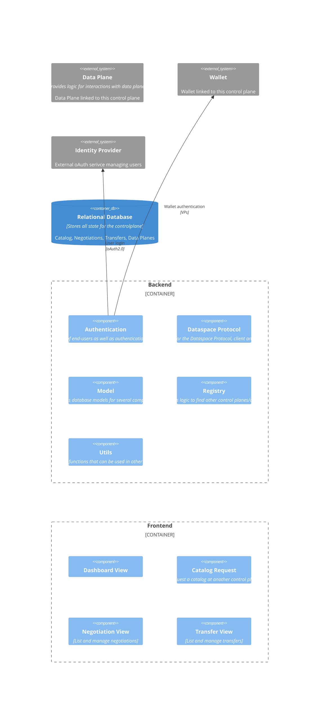

# Logical view

```mermaid
C4Component
    Container_Boundary(backend, "Backend") {
        Component(auth, "Authentication", "Provides authentication of end-users as well as authentication of other Control Planes")
        Component(data-plane, "Data Planes", "Provides logic for interactions with data planes")
        Component(dsp, "Dataspace Protocol", "Provides logic for the Dataspace Protocol, client and provider side")
        Component(model, "Model", "Provides database models for several components")
        Component(registry, "Registry", "Provides logic to find other control planes/catalogs")
        Component(utils, "Utils", "Provides util functions that can be used in other components")
        Rel(auth, oauth, "User login", "oAuth2.0")
        Rel(auth, wallet, "Wallet authentication", "VPs")
    }
    System_Ext(wallet, "Wallet", "Wallet linked to this control plane")
    System_Ext(data-plane, "Data Plane", "Data Plane linked to this control plane")
    System_Ext(oauth, "Identity Provider", "External oAuth serivce managing users")

    ContainerDb(db, "Relational Database", "Stores all state for the controlplane", "Catalog, Negotiations, Transfers, Data Planes")
    %% Component(frontend, "Frontend", "Provides all management functionality of the Control Plane")
    Container_Boundary(frontend, "Frontend") {
        Component(dashboardview, "Dashboard View")
        Component(catalogview, "Catalog Request", "Request a catalog at another control plane")
        Component(negotiationview, "Negotiation View", "List and manage negotiations")
        Component(transferview, "Transfer View", "List and manage transfers")
    }
UpdateLayoutConfig($c4ShapeInRow="3", $c4BoundaryInRow="1")
```
