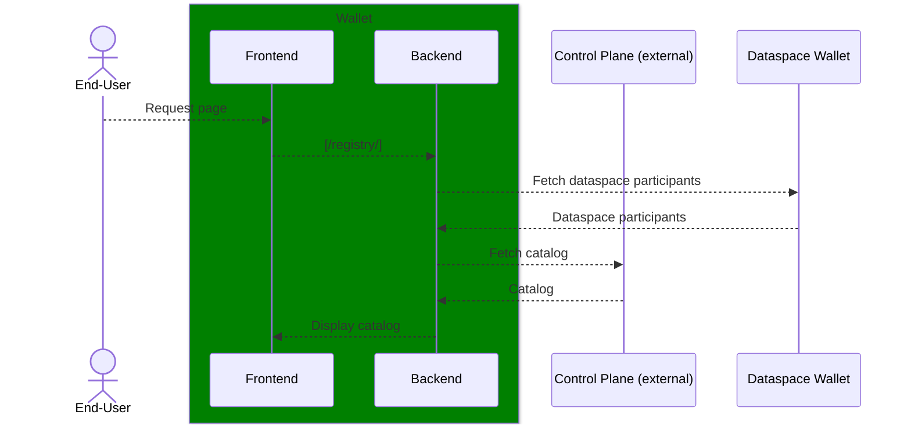
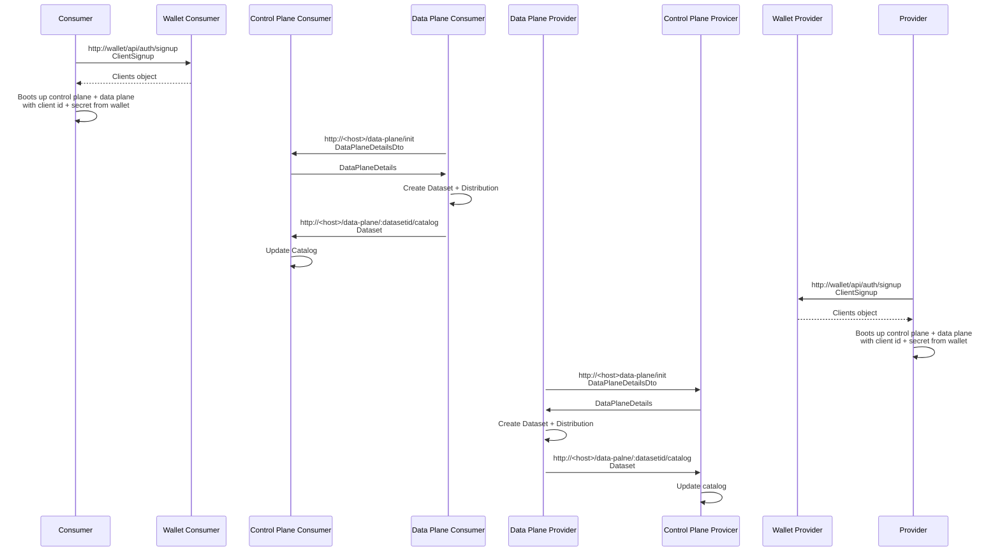
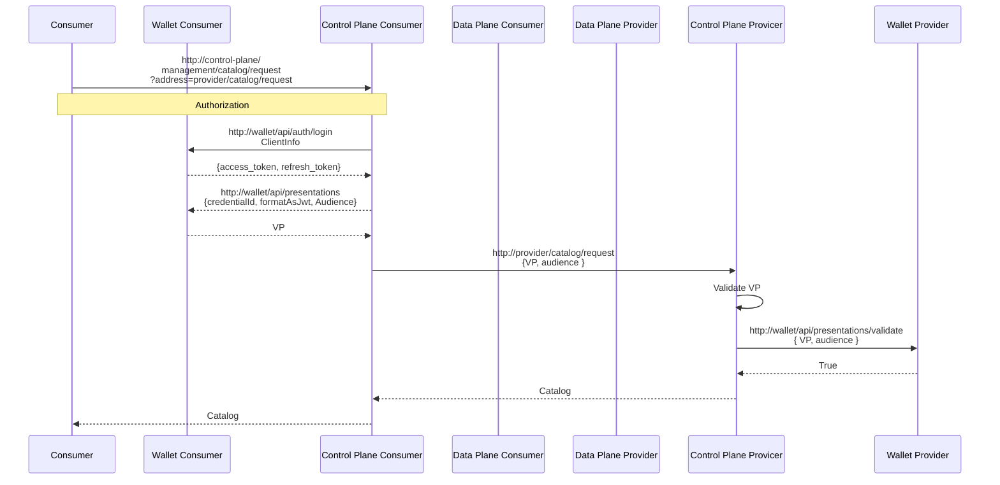
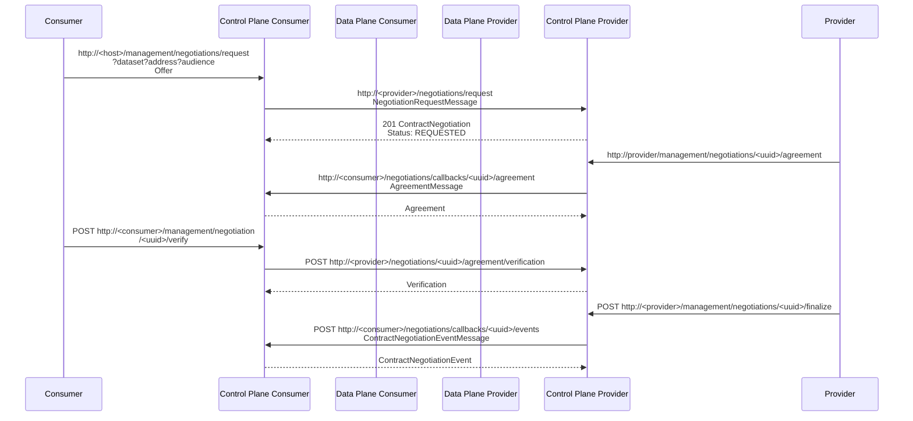
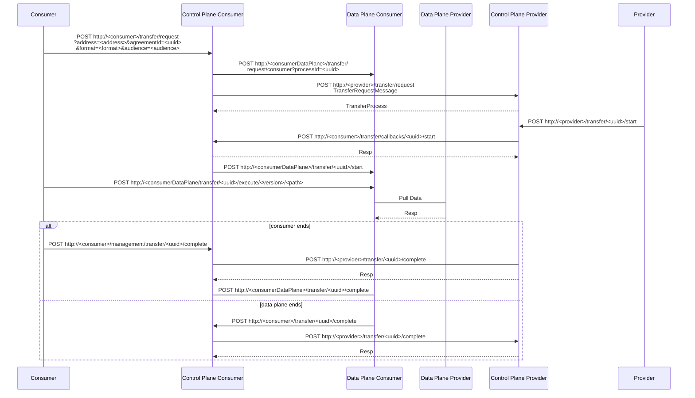

# Process View

## Registry flow

# Interactions done in DSP

The following assumptions are made:

- Authentication is necessary for retrieving catalogs.
- Datasets are obtained when querying Catalog (same authorization as retrieving catalog)

## Data Plane + Control Plane interactions for the Consumer.

### Initialization

### Catalog Request

### Contract Negotiation

### Transfer request

