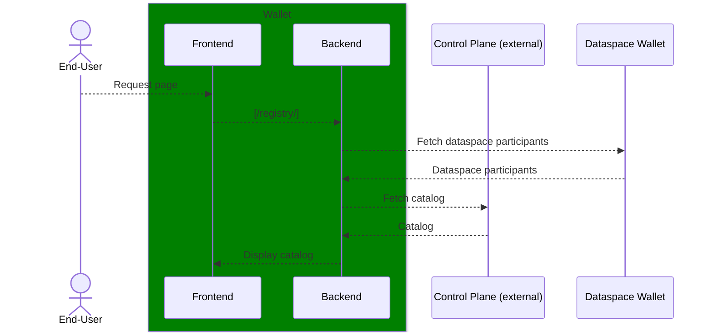

# Process View

## Registry flow

```mermaid
sequenceDiagram
actor a as End-User
  box Green Wallet
    participant f as Frontend
    participant b as Backend
  end
    participant cp as Control Plane (external)
    participant w as Dataspace Wallet
  a -->> f: Request page
  f -->> b: [/registry/]
  b -->> w: Fetch dataspace participants
  w -->> b: Dataspace participants
  b -->> cp: Fetch catalog
  cp -->> b: Catalog
  b -->> f: Display catalog

```
