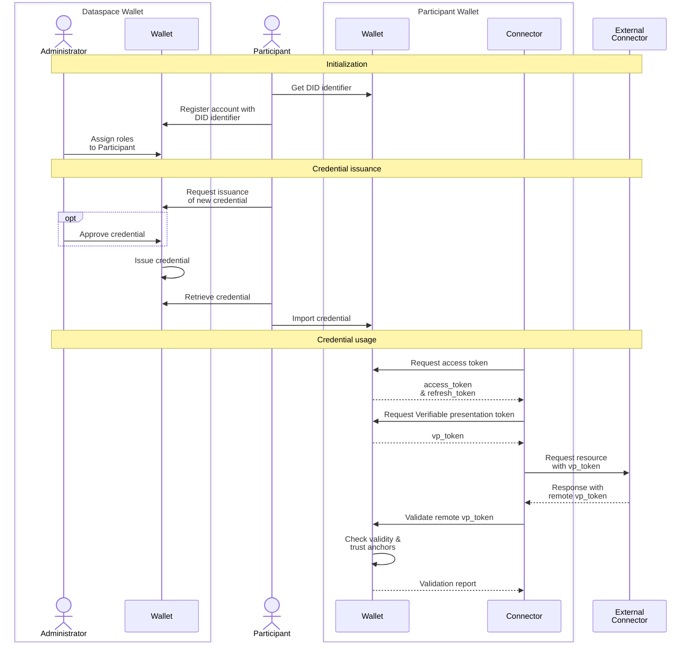

# TSG Wallet architecture

The TSG Wallet is a SSI wallet that can issue and store verifiable credentials and create presentations to be used within data spaces.

The wallet is aimed at multi-tier deployments, with one (or more) wallet that acts as trust anchor for a data space and indivual wallets for each of the participants in the data space. On this page the central wallet that issues credentials will be called the Dataspace Wallet although it is not required that there always is exactly one issuer of credentials in a dataspace.

In the sequence diagram below the process from the point of view of a participant in a dataspace is shown, where this participant has deployed its own wallet and connector. The participant uses its own DID identifier when registering at the dataspace wallet and the administrator provides the participant with roles to act on the dataspace wallet. The participant requests a credential (e.g. a membership credential for the dataspace) at the dataspace wallet, where the administrator optionally approves the credential depending on the governance model of the dataspace. The credential is issued by the dataspace wallet and the participant can retrieve this credential to import this credential in its own wallet.

For using the credential the participant configures its connector with credentials to access its own wallet. An access token can be requested from the wallet that can be used for interacting with the wallet. The connector will then request a verifiable presentation of a credential that it will use in the communication with a remote connector. When the connector receives a verifiable presentation token from a remote connector it can request validation of that token at the wallet. The wallet will then validate the token itself, and check whether the issuer of that credential is present in the trust anchors of the wallet.

## Design choices

### 1. Leveraging existing standards
Used standards:
- W3C DID [(W3C recommendation)](https://www.w3.org/TR/did-core/)
- did:web [(W3C internal document)](https://w3c-ccg.github.io/did-method-web/)
- JSON Web Signatures for Data Integrity Proofs [(W3C working draft)](https://www.w3.org/TR/vc-jws-2020/)
  - Supported JOSE signing/encryption: Ed25519/EdDSA, P-384/ES384, RSA/PS256
- Verifiable Credentials Data Model v1.1 [(W3C recommendation)](https://www.w3.org/TR/vc-data-model/)

### 2. Programming language & environment

NodeJS & Typescript are chosen as execution and development environment for these reasons:
  1. Efficiently deployable in cloud environments; considerably lower memory requirements compared to JVM-based environments
  2. Strongly typed development; given the size of the projects a strongly typed programming language is a must for maintainability of the code
  3. Easily understandable for new developers; Javascript/Typescript are more easily picked up by developers then for example Rust or Go
  4. Ability to share code/models between frontend and backend; since frontend UIs are predominantly written in Javascript/Typescript allows to share interface/classes between frontend and backend, reducing errors

### 3. Limit external dependencies

The requirement on external dependencies should be as low as possible, including only dependencies in case they provide concrete benefits. Reason for this is to keep the Software Bill of Materials as light as possible to recude security risks of these dependencies.
This also applies for dependencies of external services, in particular for authentication towards the wallet where oAuth2.0 could be an alternative to the internal authentication as used right now. The advantage of the internal authentication is that it doesn't require any external service, especially given that Keycloak (one of the most used self-hosted authentication services) is based on a JVM and uses considerably amounts of memory.

The main dependencies of the backend are:
- [NestJS framework](https://nestjs.com/)
- [Class-transformer](https://github.com/typestack/class-transformer) & [class-validator](https://github.com/typestack/class-validator)
- [Express](https://expressjs.com/)
- [Axios](https://axios-http.com/docs/intro)

The main dependencies of the frontend are:
- [Vue](https://vuejs.org/)
- [Bulma](https://bulma.io/) & [Buefy](https://buefy.org/)
- [Axios](https://axios-http.com/docs/intro)
- [HightlightJS](https://highlightjs.org/)