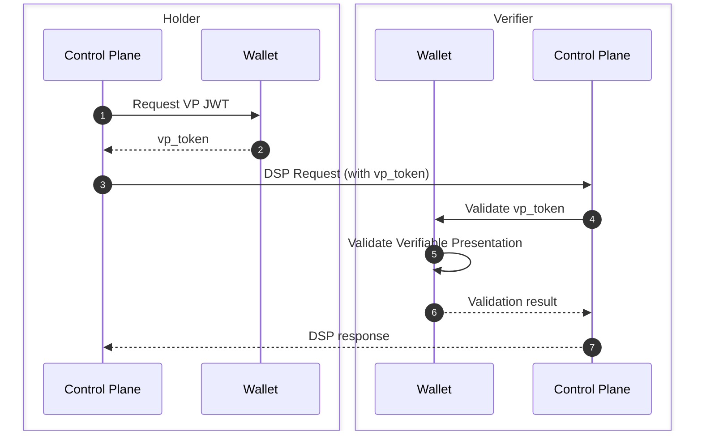
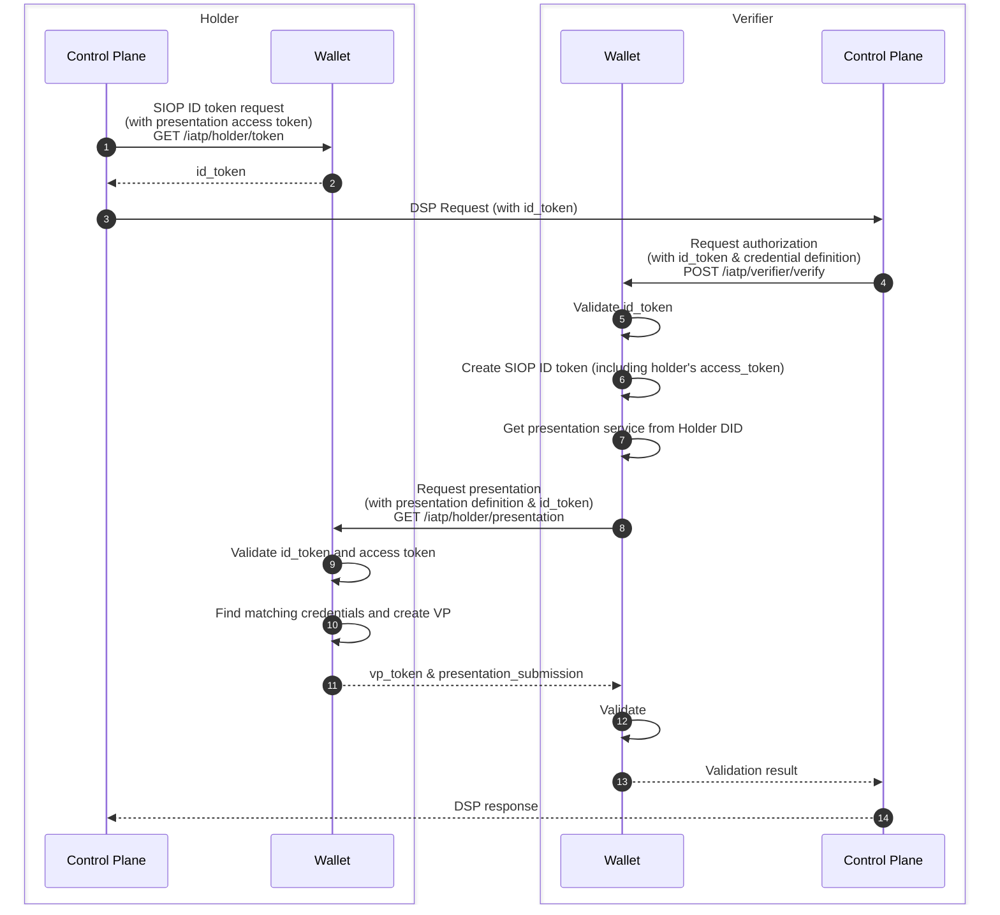

# Presentation Protocol(s)

Different protocols for exchanging Verifiable Presentations between the _holder_ of credentials and the _verifier_ can be used in different scenarios.

Currently three protocols are implemented or are candidates for implementation in the Wallet:

- Direct protocol: a simple protocol for exchaning verifiable presentations
- Identity and Trust Protocol: a protocol based on the Digital Identity Foundations Presentation Exchange specfication
- OpenID 4 Verifiable Presentations: a draft specification from the OpenID foundation

## Direct

The direct presentation protocol is a simple flow for presenting a credential to the _verifier_. Where the control plane of the holder decides which credential(s) to include in the verifiable presentation. The full presentation is shared with the verifier via the `Authorization` header.

While this is a simple way of presenting credentials to the verifier, there are some drawbacks to this approach:

- HTTP headers are often limited in size by the HTTP server implementations, resulting in maximum header sizes of 8kb (default for Nginx and Apache).
- No authentication of the verifier is executed in this flow.
- No handles for specifying which credential the verifier needs to approve the request.

## Identity and Trust Protocol (IATP)

The identity and trust protocol (IATP) defines the flow of requesting and presenting Verifiable Presentations between _verifier_ and _holder_. This protocol is largely based on the [Eclipse Tractus-X IATP](https://github.com/eclipse-tractusx/identity-trust/), and uses the following wider standards/specifications:

- [W3C Decentralized Identifiers (DIDs) v1.0](https://www.w3.org/TR/did-core/)
- [W3C Verifiable Credentials Data Model v1.1](https://www.w3.org/TR/vc-data-model/)
- [DIF Presentation Exchange 2.0.0](https://identity.foundation/presentation-exchange/spec/v2.0.0/)

The sequence diagram below shows the interactions between the wallets and control planes of the verifier and holder.

A more detailed explanation of the steps in the sequence diagram is provided in the list below:

1. Request a Self Issued ID token targeted at the verifier (_audience_) with an automatically generated access token for the verifier to request the presentation, with an optional scope to limit the access to certain credentials.  
   _**Note**_: Scopes are currently accepted but not used.
2. ID token signed with the default key defined in the wallet.
3. Data Space Protocol Request with the `id_token` as `Bearer` token in the `Authorization` header.
4. Verification request with the holder's `id_token` and a presentation definition according the [DIF Presentation Definition specification](https://identity.foundation/presentation-exchange/spec/v2.0.0/#presentation-definition).
5. Validation of the holder's `id_token`, which additionally requires resolvement of the DID document of the holder to retrieve the public key material used to sign the `id_token`.
6. Create a Self Issued ID token targeted at the holder (_audience_) incorporating the access token from the holder's `id_token`.
7. Retrieve the `"Presentation"` service from the holder's DID document to find the service endpoint for requesting the presentation.
8. Request the presentation at the service endpoint with the presentation definition and the `id_token` as `Bearer` token in the `Authorization` header.
9. Validate the verifier's `id_token` and the access token inside the `id_token`.
10. Find matching credentials based on the presentation definition and the scope of the access token. And generate a presentation submission according the [DIF Presentation Submission specification](https://identity.foundation/presentation-exchange/spec/v2.0.0/#presentation-submission).  
    _**Note**_: Scopes are currently accepted but not used.
11. Return the Verifiable Presentation in JWT format accompanied by the pesentation submission.
12. Validate the Verifiable Presentation and validate whether it matches the requested presentation definition.
13. Return the Verifiable Presentation when all checks are successful.
14. Response of the original DSP request.

## OpenID 4 Verifiable Presentations (OID4VP)

> TODO
