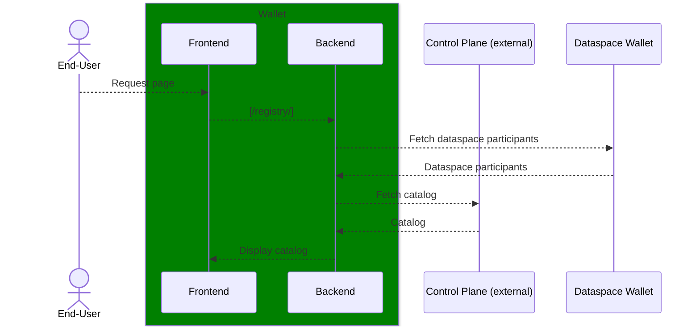
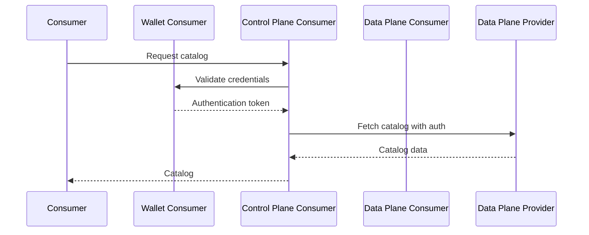
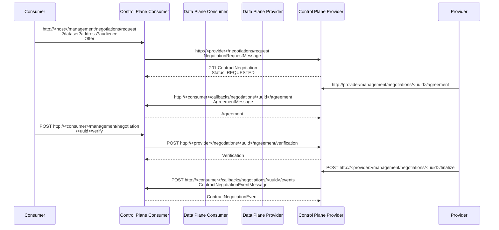
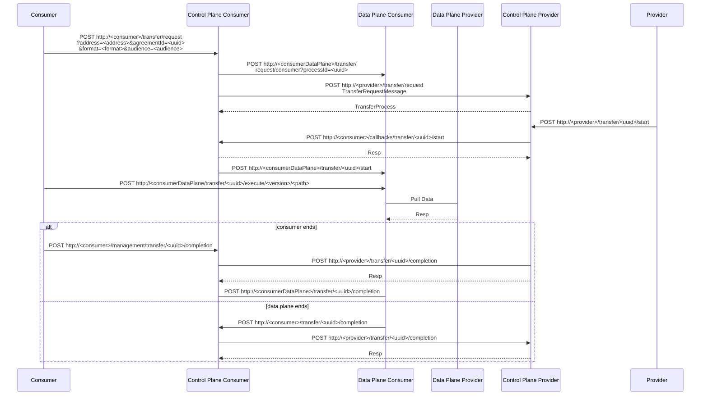

# Process Flows

This document details the key process flows and interactions within the TSG Control Plane, focusing on Dataspace Protocol implementation and component coordination. For overall system architecture, see the [TSG Architecture documentation](../../architecture/README.md).

## Registry Discovery Flow

The registry functionality enables discovery and cataloging of dataspace participants and their offerings through a federated approach that maintains participant autonomy.

**Registry Process:**
1. **Participant Discovery** - The registry maintains information about dataspace participants and their capabilities
2. **Catalog Federation** - Integrates with the `CatalogModule` to provide unified access to distributed catalogs
3. **Wallet Integration** - Uses the dataspace wallet to fetch participant information and maintain trust relationships
4. **Unified Presentation** - Registry data is combined with catalog information to present a complete view

## Dataspace Protocol Interactions

The Control Plane implements complete Dataspace Protocol flows for secure data exchange between participants. These interactions assume authentication is required for catalog access and datasets are retrieved with the same authorization as catalog access.

### Consumer-Side Interactions

#### Catalog Discovery and Initialization

#### Contract Negotiation Process

The contract negotiation follows the Dataspace Protocol specification with support for policy evaluation and agreement verification:

#### Data Transfer Execution

The transfer process coordinates between control planes and data planes to execute secure data exchange:

## Key Process Characteristics

### Authentication and Authorization
- All catalog access requires Verifiable Credential authentication
- Policy evaluation is integrated into negotiation and transfer processes
- SSI-based identity management ensures participant autonomy

### State Management
- Event-driven architecture maintains process state across negotiations and transfers
- Database persistence ensures process continuity and audit trails
- Listeners coordinate state transitions between modules

### Data Plane Coordination
- Control Plane orchestrates but delegates data handling to specialized data planes
- Transfer completion can be initiated by either consumer or data plane
- Flexible architecture supports multiple data plane types (HTTP, Analytics)

### Error Handling and Resilience
- Protocol-compliant error responses maintain interoperability
- Retry logic and state recovery ensure robust operation
- Monitoring and health checks provide operational visibility

These process flows implement the complete Dataspace Protocol specification while integrating with TSG's SSI-based identity and policy framework.
