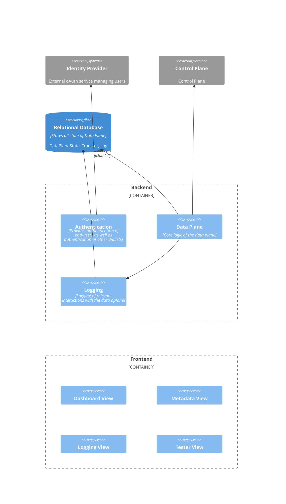
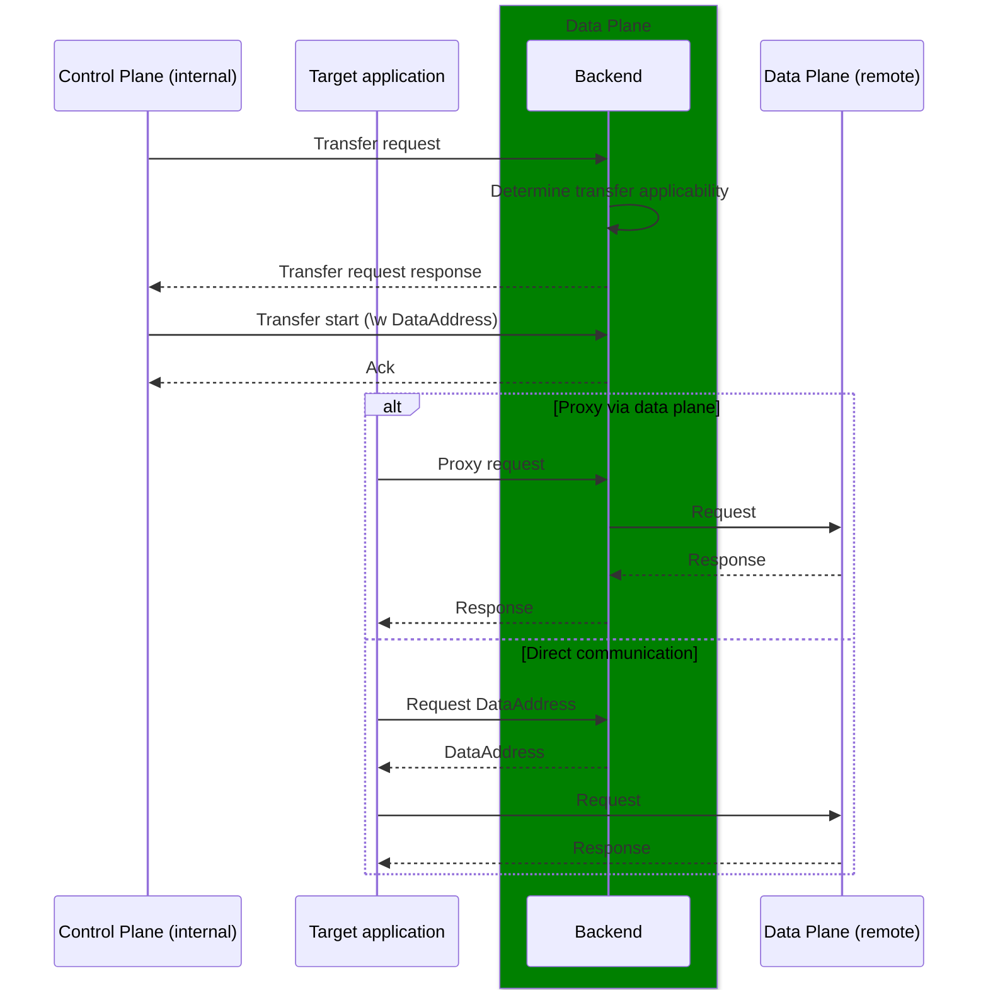
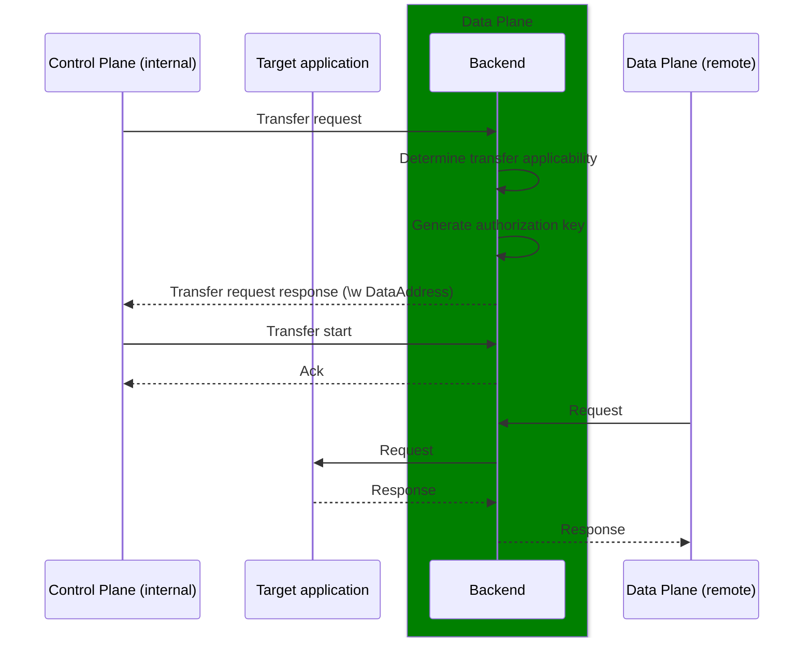

# Process Flows

This document details the architectural views and process flows within the TSG HTTP Data Plane, focusing on transfer execution and data access patterns. For overall system architecture, see the [TSG Architecture documentation](../../architecture/README.md).

## Logical View

## Process Flows

### Transfer Process Execution (Consumer-Side)

### Transfer process execution (provider-side)

