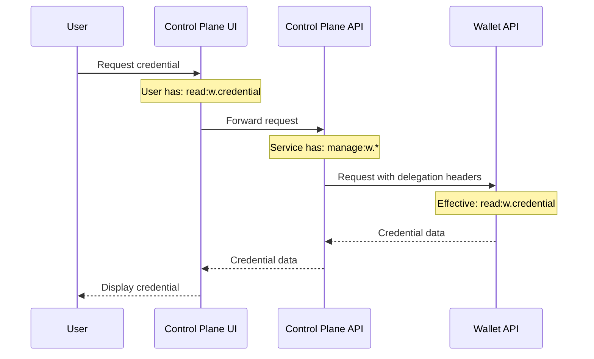

# ABAC Authorization

This page documents the Attribute-Based Access Control (ABAC) authorization system used across all TSG components for fine-grained permission management.

## Overview

The ABAC system provides a flexible, permission-based authorization mechanism that controls access to resources across the TSG ecosystem. Permissions follow a structured format that combines **actions**, **resources**, and optional **scopes** to define precise access rights.

## Permission Structure

Permissions follow the format:

```
action:resource[:scope]
```

| Component    | Description                                | Examples                                                  |
| ------------ | ------------------------------------------ | --------------------------------------------------------- |
| **Action**   | The operation being performed              | `read`, `create`, `update`, `delete`, `execute`, `manage` |
| **Resource** | The target resource, namespaced by service | `cp.catalog`, `sso.user`, `w.credential`                  |
| **Scope**    | Optional identifier(s) limiting access     | `*` (all), `own`, specific ID(s)                          |

### Examples

| Permission                      | Meaning                                                 |
| ------------------------------- | ------------------------------------------------------- |
| `read:cp.catalog`               | Read access to all catalogs in the Control Plane        |
| `manage:sso.user`               | Full management access to all users (explicit wildcard) |
| `read:w.credential:own`         | Read access only to user's own credentials              |
| `update:cp.dataset:dataset-123` | Update access to a specific dataset                     |
| `delete:cp.dataset:ds1,ds2,ds3` | Delete access to specific datasets                      |

## Actions

The following actions are available:

| Action    | Description                                                                                    |
| --------- | ---------------------------------------------------------------------------------------------- |
| `create`  | Create new resources                                                                           |
| `read`    | View/retrieve resources                                                                        |
| `update`  | Modify existing resources                                                                      |
| `delete`  | Remove resources                                                                               |
| `execute` | Execute operations (e.g., trigger transfers, sign credentials)                                 |
| `manage`  | **Full access** - includes all other actions (`create`, `read`, `update`, `delete`, `execute`) |

:::tip Manage Action
The `manage` action is a super-action that grants all permissions for a resource. A user with `manage:cp.catalog` can perform any operation on catalogs without needing separate `read:cp.catalog`, `create:cp.catalog`, etc.
:::

## Resources

Resources are namespaced by their service/component to prevent permission collision across subprojects.

### Control Plane (`cp.*`)

| Resource         | Description                        |
| ---------------- | ---------------------------------- |
| `cp.catalog`     | Catalogs containing datasets       |
| `cp.dataset`     | Individual datasets/data offerings |
| `cp.negotiation` | Contract negotiations              |
| `cp.transfer`    | Data transfers                     |
| `cp.agreement`   | Established agreements             |
| `cp.policy`      | Access policies                    |
| `cp.dataplane`   | Data plane configurations          |
| `cp.config`      | Control Plane configuration        |

### Wallet (`w.*`)

| Resource         | Description                       |
| ---------------- | --------------------------------- |
| `w.credential`   | Verifiable credentials            |
| `w.presentation` | Credential presentations          |
| `w.key`          | Cryptographic keys                |
| `w.did`          | Decentralized Identifiers         |
| `w.issue_config` | Credential issuance configuration |
| `w.config`       | Wallet configuration              |

### SSO Bridge (`sso.*`)

| Resource     | Description                       |
| ------------ | --------------------------------- |
| `sso.user`   | User accounts                     |
| `sso.client` | OAuth clients                     |
| `sso.role`   | Roles and permission groups       |
| `sso.config` | SSO Bridge configuration          |
| `sso.logs`   | Authentication/authorization logs |

### Generic Data Plane (`dp.*`)

| Resource      | Description                           |
| ------------- | ------------------------------------- |
| `dp.transfer` | Common data plane transfer operations |

### Analytics Data Plane (`adp.*`)

| Resource                | Description                        |
| ----------------------- | ---------------------------------- |
| `adp.algorithm`         | Algorithms for federated learning  |
| `adp.project_agreement` | Project agreements                 |
| `adp.orchestration`     | Orchestration configurations       |
| `adp.file`              | Files and data                     |
| `adp.dataplane`         | Analytics Data Plane settings      |
| `adp.config`            | Analytics Data Plane configuration |

### HTTP Data Plane (`hdp.*`)

| Resource        | Description                   |
| --------------- | ----------------------------- |
| `hdp.dataplane` | HTTP Data Plane settings      |
| `hdp.config`    | HTTP Data Plane configuration |
| `hdp.logs`      | Access logs                   |

## Scopes

Scopes limit the extent of a permission:

| Scope         | Description                                              |
| ------------- | -------------------------------------------------------- |
| *(none)*      | Implicit wildcard - access to all resources of this type |
| `*`           | Explicit wildcard - access to all resources              |
| `own`         | Access only to resources owned by the user               |
| `<id>`        | Access to a specific resource by ID                      |
| `<id1>,<id2>` | Access to multiple specific resources                    |

### Scope Hierarchy

```
*  (wildcard) > own > specific IDs
```

A permission with `*` scope can access any resource. A permission with `own` scope can only access resources owned by the requesting user. Specific IDs provide the most restrictive access.

:::tip Implementation status
Partial ownership implementation is available, more resource types will follow in future releases.
:::

## Configuration

### SSO Bridge Configuration

Permissions are assigned to users and clients in the SSO Bridge configuration file. The SSO Bridge supports **wildcard resource patterns** that are expanded to actual permissions when the user or client authenticates.

```yaml
initUsers:
  - username: "admin"
    password: "secure-password"
    email: "admin@example.com"
    permissions:
      # Full admin access using wildcard resource pattern
      - manage:sso.*          # Expands to manage:sso.user, manage:sso.client, etc.
      - manage:cp.*           # Expands to all Control Plane resources
      
  - username: "operator"
    password: "secure-password" 
    email: "operator@example.com"
    permissions:
      # Read access to Control Plane, execute transfers
      - read:cp.*
      - execute:cp.transfer
      - execute:cp.negotiation
      
  - username: "viewer"
    password: "secure-password"
    email: "viewer@example.com"
    permissions:
      # Read-only access to configuration
      - read:cp.config
      - read:sso.config

initClients:
  - clientId: "control-plane"
    clientSecret: "secret"
    permissions:
      # Service account for Control Plane
      - manage:cp.*
      - read:w.credential
      - create:w.presentation
```

:::warning Wildcard Expansion
Wildcard patterns (e.g., `manage:sso.*`) are **only supported in the SSO Bridge configuration**. When tokens are issued, these wildcards are expanded to the full list of matching permissions. Other services receive and validate the expanded permission list.
:::

### Supported Wildcard Patterns

| Pattern           | Expands To                                                                                        |
| ----------------- | ------------------------------------------------------------------------------------------------- |
| `read:cp.*`       | `read:cp.catalog`, `read:cp.dataset`, `read:cp.negotiation`, ...                                  |
| `manage:sso.*`    | `manage:sso.user`, `manage:sso.client`, `manage:sso.role`, `manage:sso.config`, `manage:sso.logs` |
| `read:*`          | All read permissions for all resources                                                            |
| `manage:*.config` | `manage:cp.config`, `manage:sso.config`, `manage:adp.config`, ...                                 |

## Delegation

When a service acts on behalf of a user, the ABAC system supports delegation to maintain proper authorization context and audit trails.

### How Delegation Works

1. **User authenticates** to a frontend service (e.g., Control Plane UI)
2. **Frontend service** needs to call a backend service (e.g., Wallet API)
3. **Service includes delegation headers** to indicate it's acting on behalf of the user
4. **Backend service** evaluates permissions based on the **effective permissions** (intersection of user and service permissions)

### Delegation Headers

| Header                        | Description                                                    |
| ----------------------------- | -------------------------------------------------------------- |
| `X-TSG-Original-Actor`        | JSON object containing the original user's identity            |
| `X-TSG-Delegation-Chain`      | Array of services in the delegation chain                      |
| `X-TSG-Correlation-Id`        | Unique ID for request tracing across services                  |
| `X-TSG-Origin-Timestamp`      | Timestamp when the original request was made                   |
| `X-TSG-Effective-Permissions` | Comma-separated list of effective permissions for this request |

### Effective Permissions

When delegation is active, the **effective permissions** are calculated as:

```
effectivePermissions = intersection(userPermissions, servicePermissions)
```

This ensures that:
- A service cannot escalate a user's privileges
- A user cannot gain access through a service that doesn't have permission
- Audit logs accurately reflect who requested what action

### Example Delegation Flow



### Delegation in Code

When making service-to-service calls on behalf of a user, include the delegation headers:

```typescript
// Example: Control Plane calling Wallet API on behalf of user
const response = await fetch(`${walletUrl}/api/credentials`, {
  headers: {
    'Authorization': `Bearer ${serviceToken}`,
    'X-TSG-Original-Actor': JSON.stringify({
      sub: user.sub,
      type: 'user',
      permissions: user.permissions,
      email: user.email
    }),
    'X-TSG-Delegation-Chain': JSON.stringify([
      { sub: 'control-plane', serviceName: 'control-plane-api' }
    ]),
    'X-TSG-Correlation-Id': correlationId,
    'X-TSG-Origin-Timestamp': new Date().toISOString(),
    'X-TSG-Effective-Permissions': effectivePermissions.join(',')
  }
});
```

## Protecting Endpoints

In NestJS controllers, use the `@Requires`, `@RequiresAny`, or `@RequiresAll` decorators to protect endpoints:

```typescript
import { Requires, RequiresAny, RequiresAll, ResourceIdParam } from '@tsg-dsp/common-api';
import { Action, Resource } from '@tsg-dsp/common-dtos';

@Controller('catalogs')
export class CatalogController {
  
  // Single permission required
  @Get()
  @Requires(Action.READ, Resource.CP_CATALOG)
  findAll() { /* ... */ }

  // Any of the listed permissions grants access
  @Post()
  @RequiresAny([
    { action: Action.CREATE, resource: Resource.CP_CATALOG },
    { action: Action.MANAGE, resource: Resource.CP_CATALOG }
  ])
  create() { /* ... */ }

  // All listed permissions required
  @Delete(':id')
  @RequiresAll([
    { action: Action.DELETE, resource: Resource.CP_CATALOG },
    { action: Action.READ, resource: Resource.CP_POLICY }
  ])
  @ResourceIdParam('id')  // Enables scope-based filtering
  remove(@Param('id') id: string) { /* ... */ }
}
```

### Scope-Based Access Control

When `@ResourceIdParam` is used, the ABAC system automatically enforces scope restrictions:

- User with `read:cp.catalog` → Can read all catalogs
- User with `read:cp.catalog:own` → Can only read catalogs they own
- User with `read:cp.catalog:cat-123` → Can only read the specific catalog

## Audit Logging

All authorization decisions are logged for compliance and debugging:

```json
{
  "timestamp": "2024-01-15T10:30:00.000Z",
  "caller": {
    "sub": "user-123",
    "type": "user",
    "email": "user@example.com"
  },
  "onBehalfOf": null,
  "action": "read",
  "resource": {
    "type": "cp.catalog",
    "id": "catalog-456"
  },
  "result": {
    "allowed": true,
    "matchedPermission": "read:cp.catalog",
    "effectiveScope": "*"
  },
  "severity": "INFO"
}
```

:::tip Audit Log storage and viewing
Logs are currently only written to standard output. Future releases will include centralized log storage, querying and visualization capabilities.
:::

## Best Practices

1. **Use the `manage` action sparingly** - Grant specific actions when possible
2. **Prefer `own` scope for user-facing resources** - Limits exposure to only user's data
3. **Use service accounts with minimal permissions** - Follow principle of least privilege
4. **Configure wildcard patterns only in SSO Bridge** - Ensures proper expansion and validation
5. **Always include correlation IDs in delegation** - Enables end-to-end request tracing
6. **Review audit logs regularly** - Monitor for unauthorized access attempts

---

For implementation details, see the source code in `libs/common-api/src/auth/abac/`.
