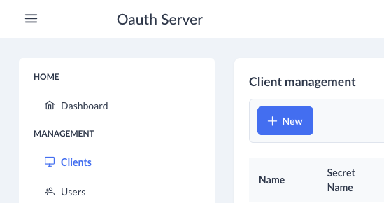
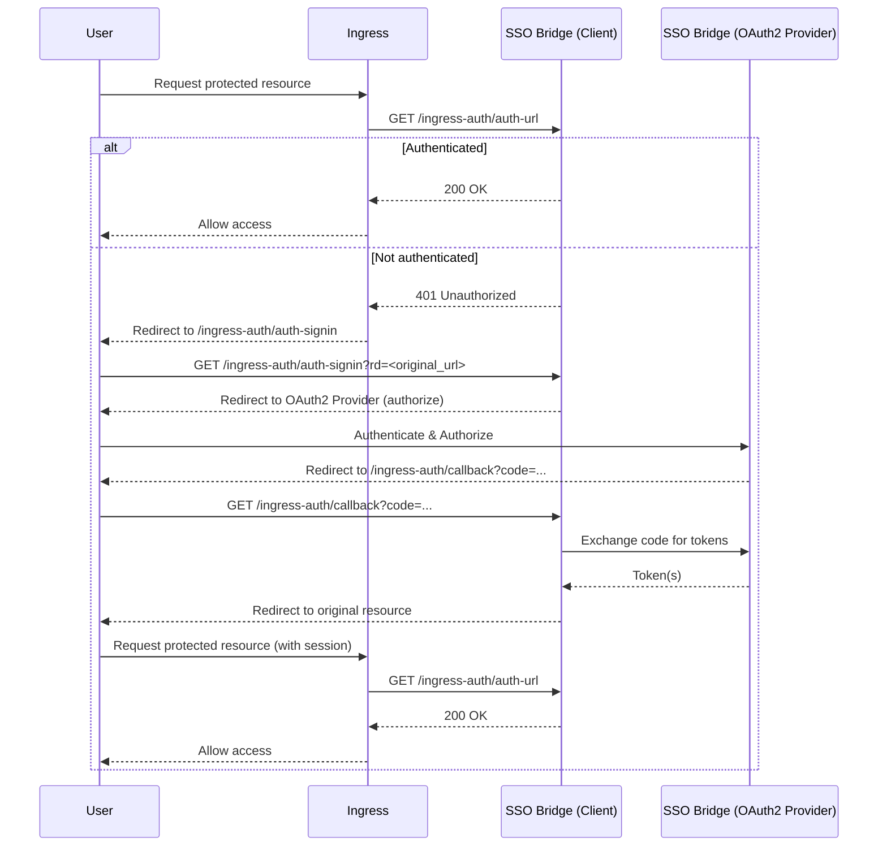

# Ingress Authentication

This page documents the usage and integration of the Ingress Auth 
feature of the SSO Bridge, designed for use with the [Kubernetes NGINX Ingress Controller](https://kubernetes.github.io/ingress-nginx/).

## Overview

The SSO Bridge provides endpoints to enable OAuth2-based authentication for applications protected by the NGINX Ingress Controller. It implements the external authentication flow using the following ingress annotations:

- `nginx.ingress.kubernetes.io/auth-url`
- `nginx.ingress.kubernetes.io/auth-signin`

These annotations allow the ingress controller to delegate authentication to the SSO Bridge, which manages the OAuth2 login flow and session management.

## App creation in SSO Bridge
Login to the SSO Bridge and navigate to the `Clients` tab as displayed below. 



Create a new client for your application with the following attributes:
- **Name** (Name of your application)
- **Secret Name** (Name of the Kubernetes secret that holds the credentials)
- **Description** (Description to clarify the exact application)
- **Client ID** 
- **Client Secret**
- **Roles** (If you require any roles)
- **Grants** These should be set to `client_credentials`.

## Required Ingress Annotations

Add the following annotations to your ingress resource:

```yaml
nginx.ingress.kubernetes.io/auth-url: "https://<your-sso-bridge>/api/ingress-auth/auth-url"
nginx.ingress.kubernetes.io/auth-signin: "https://<your-sso-bridge>/api/ingress-auth/auth-signin?clientId=<your-client-id>&rd=$request_uri"
```

- `auth-url`: Called by ingress to check authentication status.
- `auth-signin`: Where unauthenticated users are redirected to start the login flow. Fill in the `Client ID` of the SSO Bridge application that you just created in the `<your-client-id>` placeholder.
## Example Ingress Resource

```yaml
apiVersion: networking.k8s.io/v1
kind: Ingress
metadata:
  name: my-app
  annotations:
    nginx.ingress.kubernetes.io/auth-url: "https://example.com/api/ingress-auth/auth-url"
    nginx.ingress.kubernetes.io/auth-signin: "https://example.com/api/ingress-auth/auth-signin?clientId=my-example-client-id&rd=$request_uri"
spec:
  rules:
    - host: my-app.example.com
      http:
        paths:
          - path: /
            pathType: Prefix
            backend:
              service:
                name: my-app-service
                port:
                  number: 80
```

## How It Works

1. **User requests a protected resource** via the ingress.
2. **Ingress calls `/ingress-auth/auth-url`** to check if the user is authenticated.
   - If authenticated, the request proceeds.
   - If not, ingress returns a 401 and redirects the user to `/ingress-auth/auth-signin`.
3. **`/ingress-auth/auth-signin`** initiates the OAuth2 flow, redirecting the user to the authorization server.
4. **After login, the OAuth2 provider redirects to `/ingress-auth/callback`**.
5. **`/ingress-auth/callback`** exchanges the code for tokens, establishes a session, and redirects the user to their original destination.

## Sequence Diagram



## Notes & Best Practices

- The SSO Bridge must be accessible to the ingress controller and users.
- At the moment, you can only use the Ingress Authentication for subdomains or paths of the SSO Bridge location. For example if you host your SSO Bridge on `example.com` only applications hosted on `*.example.com` and `example.com/*` can be used for ingress authentication.
- **OPTIONAL** If you want to use logout, you have to implement the `ingress-auth/logout` endpoint in your own application. This will remove the user object on the session.

## Troubleshooting

- If authentication works in a browser but not via ingress, check that the `Set-Cookie` header is present and not stripped by ingress.
- Use browser dev tools to verify cookies are set and sent on subsequent requests.

---

For more details, see the implementation in `ingress-auth.controller.ts` and `ingress-auth.service.ts`.
