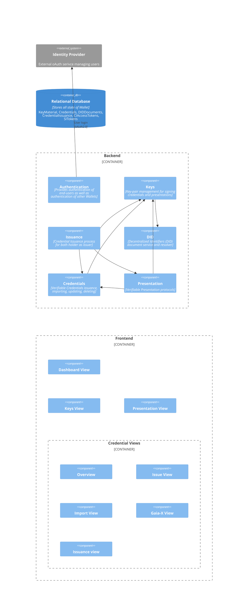

# Logical view

Backend components:

- **Authentication**: Provides Guards to secure controllers.
- **DID**: Provides the DID document of the Wallet instance, as well as resolvement of DID identifiers to documents.
- **Keys**: Provides public-private key pairs for signing credentials, presentations, issuance requests.
- **Credentials**: Provides Verifiable Credential management.
- **Issuance**: Provides VC issuance process between two wallet instances.
- **Presentation**: Provides Verifiable Presentation creating/verification, with several supported processes of exchanging VPs between systems.

Frontend views:

- **Dashboard**: Overview of the Wallet instance.
- **Keys**: Key management.
- **Presentation**: Manual Presentation invocation.
- **Credentials Overview**: Credential management.
- **Credentials Issue**: Manual issuance of credentials.
- **Credentials Import**: Manual import of credentials.
- **Credentials Gaia-X**: Gaia-X Digital Clearing House credential support.
- **Credentials OID4VCI**: Credential issuance between two wallet instances.
