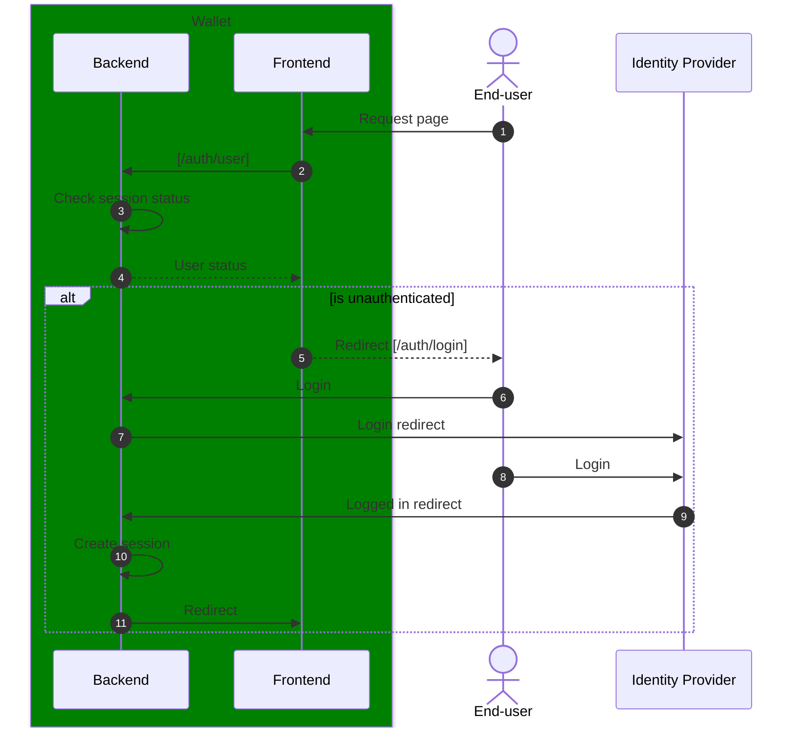
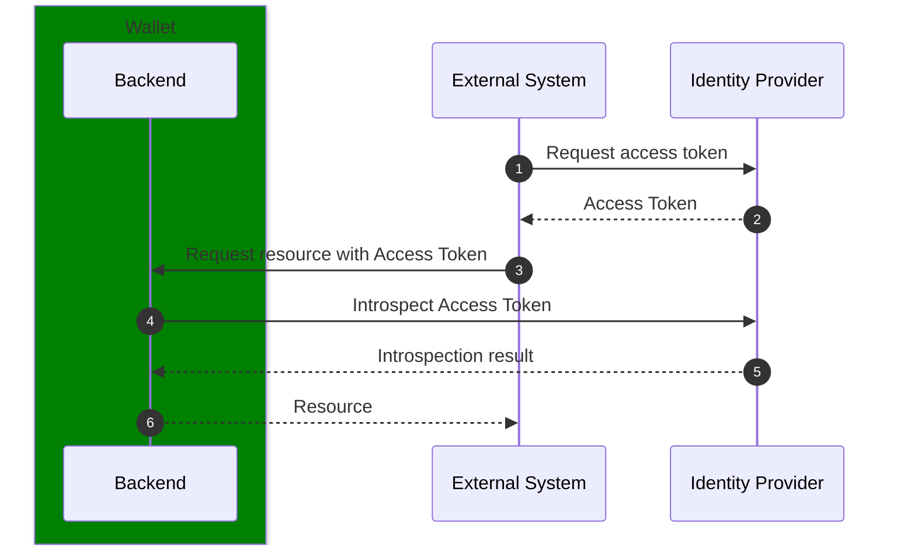
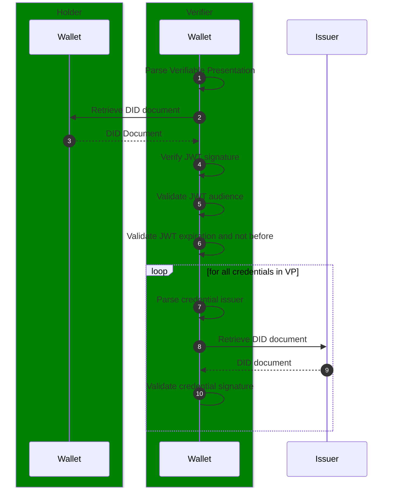
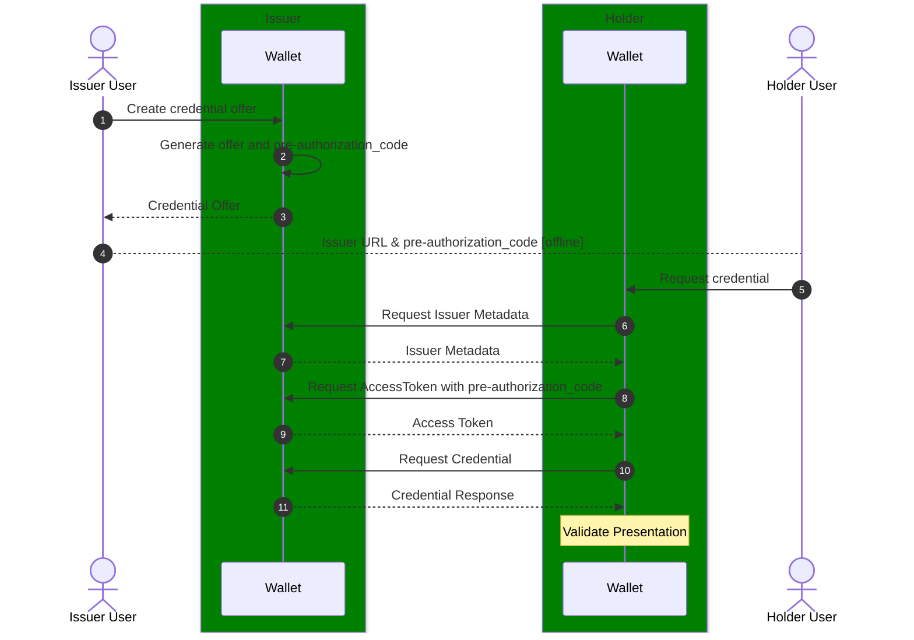
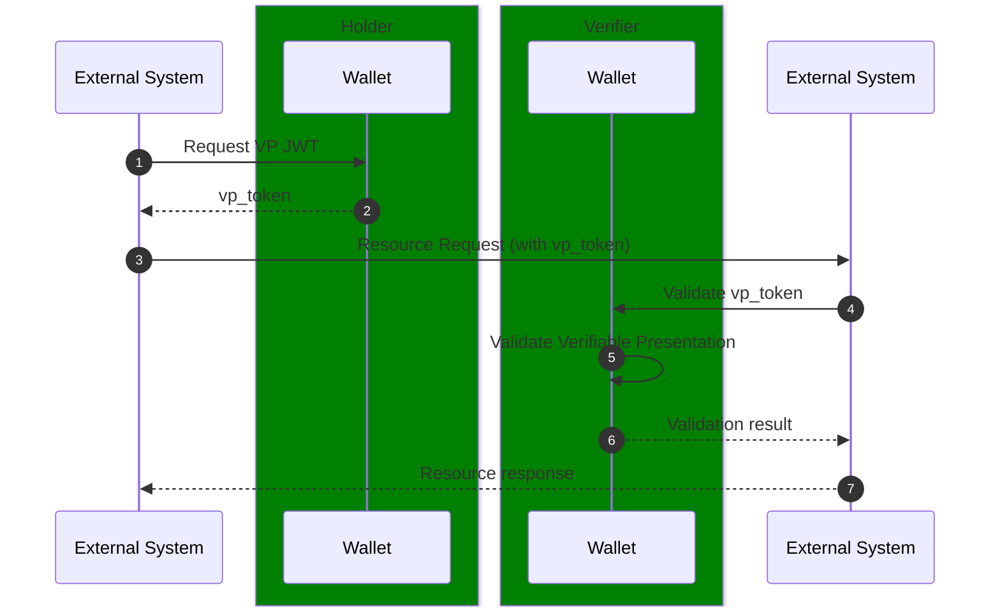
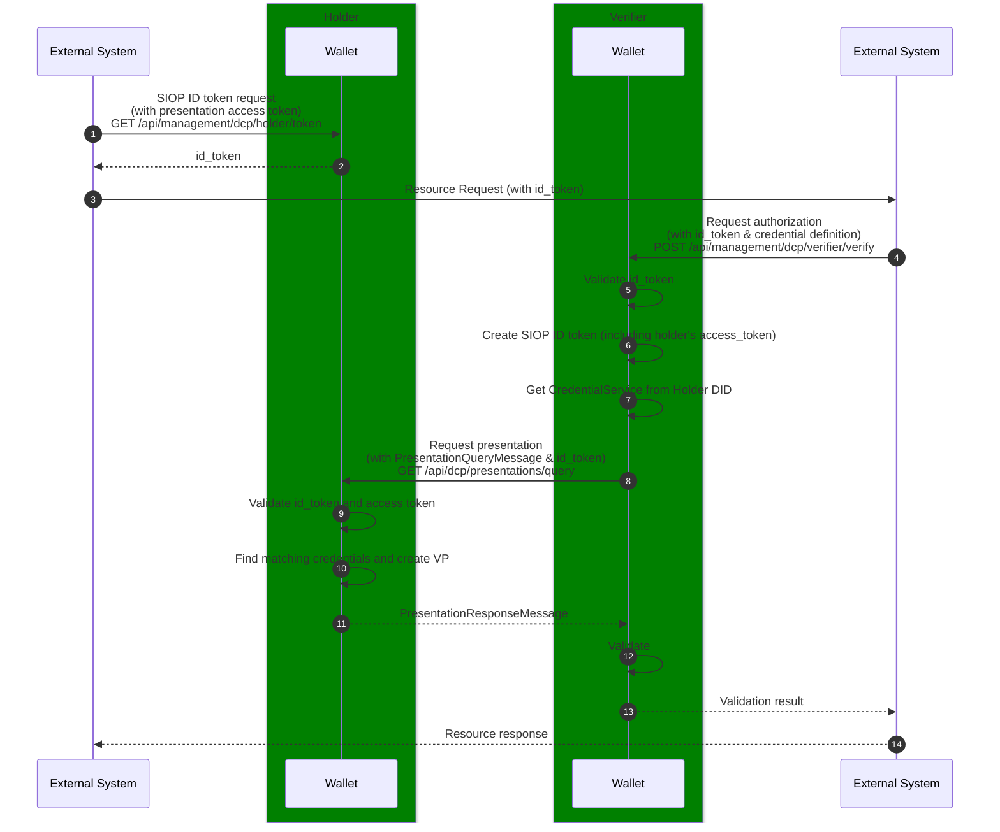

# Process View

The following processes are further detailed on this page:

- Authentication flow
- Issuance flow
- Direct Presentation flow
- DCP Presentation flow

## Authentication flow

The authentication flows are either between the wallet and the UI or the wallet and an external system within the same security domain of the wallet.

### Frontend

### External system

## Verifiable Presentation verification flow

## Issuance flow

This flow describes the process of exchanging a new credential between two Wallet instances

## Presentation Protocol(s)

Different protocols for exchanging Verifiable Presentations between the _holder_ of credentials and the _verifier_ can be used in different scenarios.

Currently three protocols are implemented or are candidates for implementation in the Wallet:

- Direct protocol: a simple protocol for exchaning verifiable presentations
- [Decentralized Trust Protocol](https://eclipse-dataspace-dcp.github.io/decentralized-claims-protocol): a protocol based on the Digital Identity Foundations Presentation Exchange specfication
- OpenID 4 Verifiable Presentations: a draft specification from the OpenID foundation (not yet implemented)

### Direct

The direct presentation protocol is a simple flow for presenting a credential to the _verifier_. Where the control plane of the holder decides which credential(s) to include in the verifiable presentation. The full presentation is shared with the verifier via the `Authorization` header.

While this is a simple way of presenting credentials to the verifier, there are some drawbacks to this approach:

- HTTP headers are often limited in size by the HTTP server implementations, resulting in maximum header sizes of 8kb (default for Nginx and Apache).
- No authentication of the verifier is executed in this flow.
- No handles for specifying which credential the verifier needs to approve the request.

> Note: The direct presentation protocol is likely to be deprecated

### Decentralized Claims Protocol

The Decentralized Claims Protocol (DCP) defines the flow of requesting and presenting Verifiable Presentations between _verifier_ and _holder_. The protocol is described at [Eclipse Decentralized Claims Protocol](https://eclipse-dataspace-dcp.github.io/decentralized-claims-protocol)

The sequence diagram below shows the interactions between the wallets and control planes of the verifier and holder from a perspective of the TSG components. Which also includes the management interfaces that are not part of the DCP itself.

A more detailed explanation of the steps in the sequence diagram is provided in the list below:

1. Request a Self Issued ID token targeted at the verifier (_audience_) with an automatically generated access token for the verifier to request the presentation, with an optional scope to limit the access to certain credentials.  
   _**Note**_: Scopes are currently accepted but not used.
2. ID token signed with the default key defined in the wallet.
3. Data Space Protocol Request with the `id_token` as `Bearer` token in the `Authorization` header.
4. Verification request with the holder's `id_token` and a presentation definition according the [DIF Presentation Definition specification](https://identity.foundation/presentation-exchange/spec/v2.0.0/#presentation-definition).
5. Validation of the holder's `id_token`, which additionally requires resolvement of the DID document of the holder to retrieve the public key material used to sign the `id_token`.
6. Create a Self Issued ID token targeted at the holder (_audience_) incorporating the access token from the holder's `id_token`.
7. Retrieve the `"CredentialService"` service from the holder's DID document to find the service endpoint for requesting the presentation.
8. Request the presentation at the service endpoint with a DCP `PresentationQueryMessage` and the `id_token` as `Bearer` token in the `Authorization` header.
9. Validate the verifier's `id_token` and the access token inside the `id_token`.
10. Find matching credentials based on the presentation definition and the scope of the access token.
11. Return the Verifiable Presentation in a DCP `PresentationResponseMessage`.
12. Validate the Verifiable Presentation and validate whether it matches the requested presentation definition.
13. Return the Verifiable Presentation when all checks are successful.
14. Response of the original DSP request.
